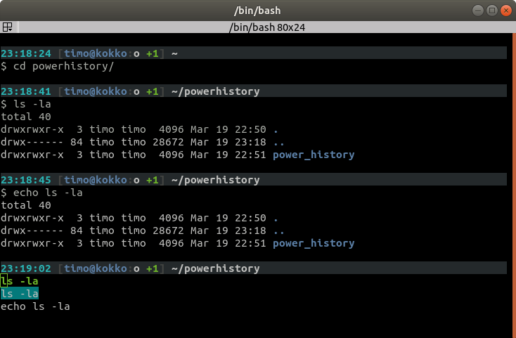

# Power History

The CTRL+R history search in bash is pretty good, but has some shortcomings. 
It generally does not seem to match commands in the order you would 
intuitively expect. If the substring matches anywhere on the command, you 
get the latest command entered. 

e.g.

```
$ ls -la 
$ echo ls -la
ls -la
(reverse-i-search)`ls': echo ls -la
```

Power History introduces a new keyboard shortcut in bash CTRL+E, which gives
you a more powerful and interactive way to go back in your command history. 
Because of the way it's duct taped to Bash, however, there are a few side
effects:

  1. When you press CTRL+E your command history is written to `.bash_history` 
  2. Your current print out history will move up
  
Also, for this to work you require a modern terminal that supports all
the ANSI escape codes. 

Here's how it looks in my terminal. If you are interested, the shell 
prompt is 
```
PS1="\n\[\033[40m\]\[\e[1;36m\]\t \[\e[1;30m\][\[\e[1;34m\]\u@\H\[\e[1;30m\]:\[\e[1;37m\]${SSH_TTY:-o} \[\e[1;32m\]+${SHLVL}\[\e[1;30m\]] \[\e[1;37m\]\w\[\e[1;37m\]\[\033[0K\]\[\e[0;37m\]\n$ "
```




The green text is what I typed to search the command history. The line
with cyan background is the selected command from the history. You can
use arrow keys to move up and down the list. Up to 6 matching entries 
are displayed, but you can scroll up and down through all the matches. 

If you type more characters, the selection will reset to the top match 
(at least for now). Once you press enter, the selected command will be 
executed. You can bail out with ESC.

TODO: Other special keys may really mess up the printout and history. 
This may be fixed in a future version.


## Installation

Simply clone this repository and run `install.sh`

